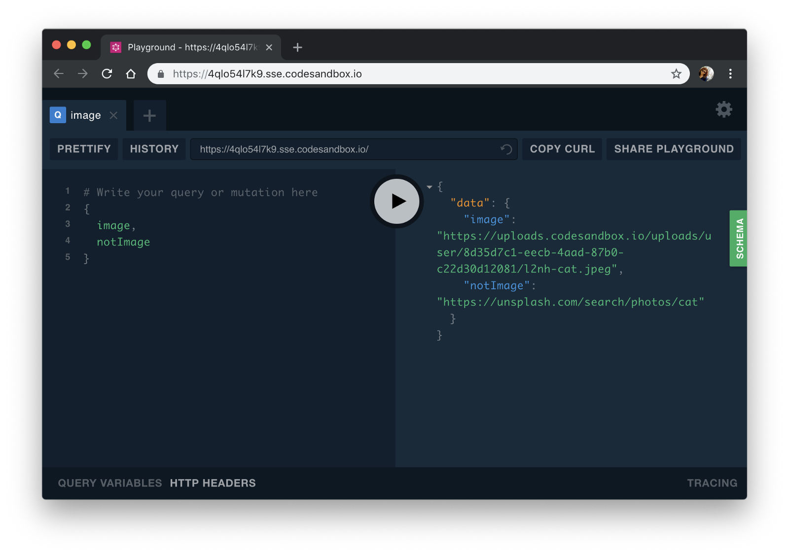
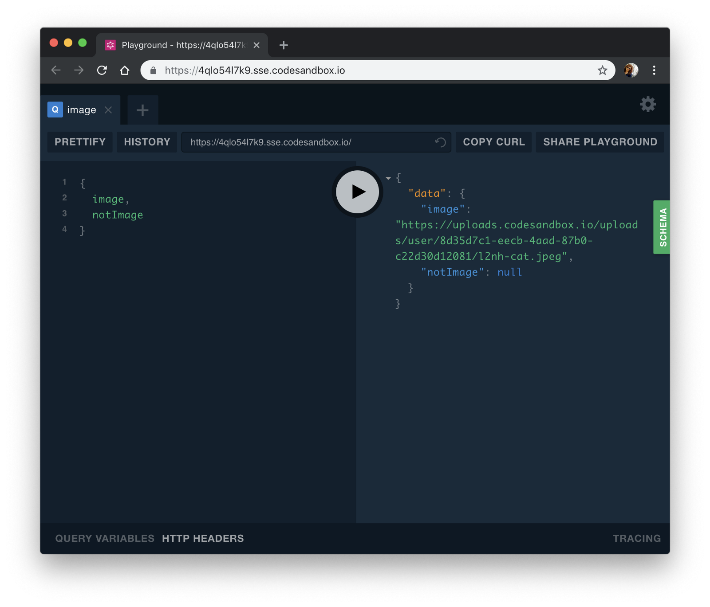
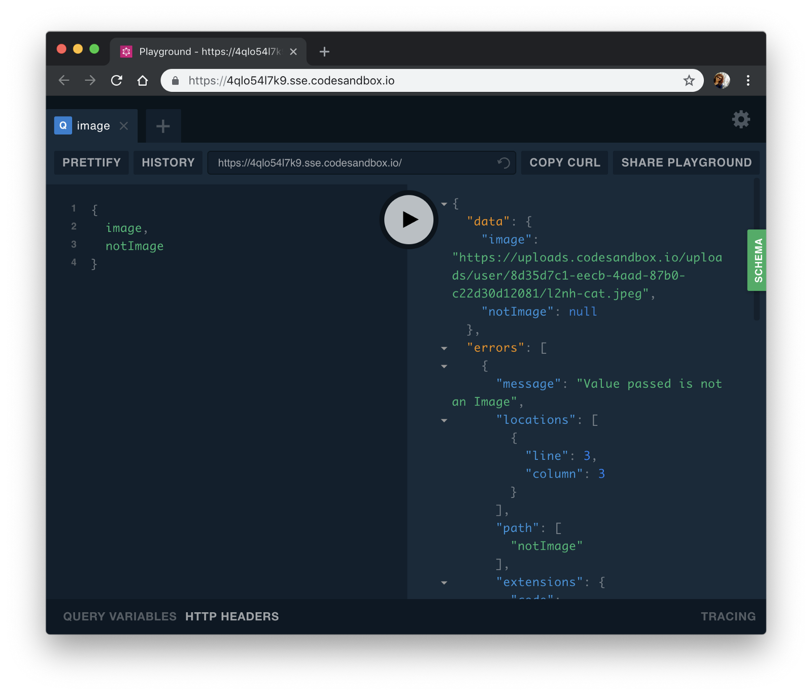

One good thing about [GraphQL](https://www.yld.io/speciality/graphql/) is having control over how our schema and our return values from an API will look like. We can type everything and make sure that if we say something is a string and it’s not we will get an error.

That is amazing for having way more confidence in our code and in what comes back from the backend but by default GraphQL only ships with some basic types.

At the moment the basic types that ship with GraphQL are:`String`, `Int`, `Float`, `Boolean`,`ID` and even though all these types are very useful they do not cover everything we want to do in our API. Let’s say we have a list of images returned from an API in GraphQL, we can test if it’s a string but it may be a string that’s not actually an image and we will be showing a broken image to our users.

In this article let’s go over how to create what is called a Scalar type in GraphQL which is basically just a fancy term to say we are creating a new type we can use in our Schema.

### Creating the server

I’m gonna use the Apollo Server 2 to get us to create a simple GraphQL server and if you want to follow along you can do by forking this [sandbox](https://codesandbox.io/s/apollo-server) or by starting locally.

To start locally you will need to install `apollo-server` ,`graphql` and `nodemon` so you will need to run:

Embed placeholder 0.9946810759038411

After that create a package.json and add the following lines:

Embed placeholder 0.42708401543478236

Now we can start coding our GraphQL server and in my case, I will only have a Schema with two values: `image` and `notImage` so we can test our custom scalar.

So our index.js should be something like:

Embed placeholder 0.683918263471962

if you now run `npm start` you will see something like this:

As you can see we have two values, they are both strings so GraphQL doesn’t care if it’s an image or not but we do so let’s start writing our custom scalar.

### Writing your custom scalar

What our custom scalar will do is test if our link is actually an image and one way we can do that is to simply check if the link ends in an image extension but as you may imagine there are a lot of those so we are gonna use a tiny library that contains most of these file extensions and you can find on [npm](https://www.npmjs.com/package/image-extensions).

After installing it let’s start writing our function that will test if a value is actually an image:

Embed placeholder 0.4079227327085426

What we are doing here is getting the image extension with `path.extname` and removing the first character as that is the dot. After this, we see if the extension we get back is part of the known image extensions and if so we return the value given to us otherwise we return null.

Our function is done and now we need to actually create our custom scalar and for that, we need the function `GraphQLScalarType` from `graphql` and then create a `new GraphQLScalarType` and for that, we need a couple of things.

-   Name — The name of our type and in my case, I will name it image.
-   Description — This is where you create a small description of what your type validates.
-   serialize — This function receives the value we receive in our GraphQL query and this is where we do the actual validation to check if the value is an image. If it is you can return the same value and if not we should return an error that explains to the user what happened. This is the only mandatory function.
-   parseValue — This function is the first one we get and it serves the idea of allowing us to clean out our value and serve it as we want to the serialize function.
-   parseLiteral — Serves the same point as parseValue but this one receives the AST and not just the value so it also gives you access to things like what kind of value it is.

The parseValue and parseLiteral functions are needed if your Scalar is also an input type.

In our case, we are going to use the serialize function to see validate our value but the same principles of validation apply to all of them.

Embed placeholder 0.1233740265654053

As you can see we assigned our Scalar to a constant and instantiated the `GraphQLScalarType` class.

As for the name I called it Image and gave it a small description and as for the serializer function I get the value and run that value through our `isImage` function that will either return the value back to the user or return null.

In order to use our custom scalar, we need to do two things first.

We need to define it in our Resolvers like so:

Embed placeholder 0.47491760555480966

And also call it at the beginning of our type definitions like so:

Embed placeholder 0.014785753141555391

If you now try to run our query you will get null in the `notImage` like so:

### Adding Errors

This is all good and we now don’t return the value but it would be better if we could return an error that would explain to the user why that value didn’t come back.

We can do that by importing `GraphQLError` from the graphql package and use it as we would use the `Error` function in JavaScript.

Instead of returning null let’s now throw the error in our `isImage` function:

Embed placeholder 0.6975908952927281

If you now try to run the exact same query you will get an error either saying that it’s not a string or not an image depending on what you passed to the resolver.

If you run it now you should see a new array of errors after the data:

Awesome! We created our first Scalar and used it to validate Image links.

You can see the finished code here:

<Embed src="https://codesandbox.io/embed/4qlo54l7k9?view=preview" height={350} width={700} />

If you wanna see more examples I suggest looking at the source code of libraries like `[graphql-scalars](https://github.com/Saeris/graphql-scalars)` and see how they handle the validation.

---

Photo by [Blake Connally](https://unsplash.com/photos/B3l0g6HLxr8?utm_source=unsplash&utm_medium=referral&utm_content=creditCopyText) on [Unsplash](https://unsplash.com/search/photos/computer?utm_source=unsplash&utm_medium=referral&utm_content=creditCopyText)

Written by Sara Vieira — Developer Advocate at [YLD](https://www.yld.io/).

---

#### Interested in GraphQL? You may also like:

[**Easier GraphQL wrappers for your REST API’s**  
_A very common use case for building GraphQL API’s is to wrap Rest API’s for a better experience in the Frontend and…_medium.com](https://medium.com/yld-engineering-blog/easier-graphql-wrappers-for-your-rest-apis-1410b0b5446d "https://medium.com/yld-engineering-blog/easier-graphql-wrappers-for-your-rest-apis-1410b0b5446d")

[**The new Apollo Server is 💯**  
_On the 15th I was at GraphQL Europe and I want take some time to talk about the new release by the awesome apollo team…_medium.com](https://medium.com/yld-engineering-blog/the-new-apollo-server-is-3f2119e4e7c9 "https://medium.com/yld-engineering-blog/the-new-apollo-server-is-3f2119e4e7c9")