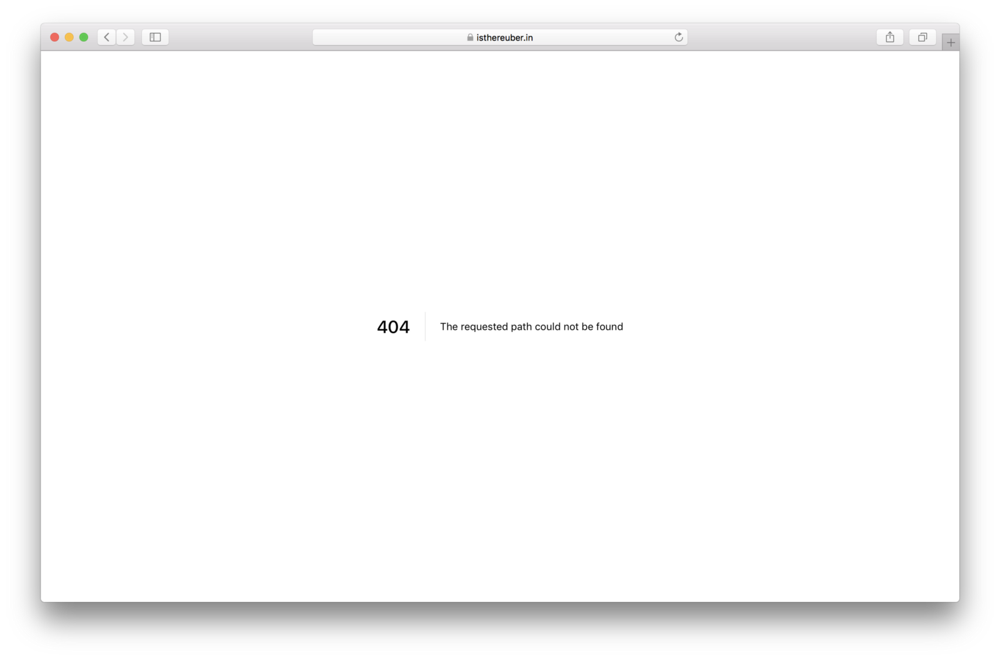

> First thank you to [Simona Cotin](https://medium.com/@simonaco) and [Super Diana](https://medium.com/@superdiana) for answering the noob docker and nginx questions and reminding me that nginx is better for static files than node. Also thank you to the amazing humans who built a [Docker extension](https://github.com/Microsoft/vscode-docker) for VSCode.

One of my main frustrations when it comes to Create [React](https://www.yld.io/speciality/react-js/) App, or really any frontend app that is served statically without a server backing it, is that your routes are now gone. You can access them from inside the app and go from page to page but if you try to access a page directly well… This happens: [https://isthereuber.in/leiria](https://isthereuber.in/leiria)

This is not okay, I know the website is static but the user doesn’t need to know.

### Nginx to the Rescue

We will now need to create a nginx configuration for our server. The reason I choose nginx over node is mostly because it has been proven to be faster for static assets but you can totally do this with node.

A configuration file for nginx is a nginx_.conf_ file so let’s start by creating that file and start coding it:

Embed placeholder 0.4778393443621556

This is a pretty standard configuration for nginx and we tell it where to show our files and what the cache expiration date is. There is also some helpers for 404 and logs.

We don’t enable gzip here but for an example with it you can look [here](https://github.com/SaraVieira/rick-morty-random-episode/blob/master/nginx.conf).

### Docker time

Now that we have our nginx config we can now create our [_Dockerfile_](https://medium.com/yld-engineering-blog/when-should-i-use-docker-77ae2736a487) and we will start by stating what is the base image we will be using:

Embed placeholder 0.4777285284882118

After this we need to tell docker what it needs to run our app and in this case we need to do three things:

-   Copy the _build_ folder over to _/var/www_
-   Copy the nginx_.conf_ to it’s folder in _/etc/_nginx_/_
-   Expose the port 80 to the public since that is the one we are using in the nginx config

Details on how to do this are below:

Embed placeholder 0.6655652056078076

Now to finish our _Dockerfile_ we need to tell it what command to run and for that we will the nginx cli and pass it as the entrypoint in our _Dockerfile_:

Embed placeholder 0.6214610954595468

As you can see we run nginx with _\-g daemon off;_ so that nginx stays in the foreground so that Docker can track the process properly (otherwise your container will stop immediately after starting). You can read more about this [here](https://blog.phusion.nl/2015/01/20/docker-and-the-pid-1-zombie-reaping-problem/).

You can now build and tag this image with:

Embed placeholder 0.798202450167482

And then run it with:

Embed placeholder 0.7060867792605148

If you use [now](https://now.sh) you can just deploy this as it is and now will build and run the image on their own servers.

We now have static routes on our static projects! If someone hits any route on your webapp this will be redirected to index.html and your app will work flawlessly.

This is the webapp I used to test this approach: [https://github.com/SaraVieira/rick-morty-random-episode](https://github.com/SaraVieira/rick-morty-random-episode)

[https://rick-morty-random-episode.now.sh/](https://rick-morty-random-episode.now.sh/)

Routes 🎉

---

Photo by [Marten Bjork](https://unsplash.com/photos/aTt_rNa3gmM?utm_source=unsplash&utm_medium=referral&utm_content=creditCopyText) on [Unsplash](https://unsplash.com/search/photos/javascript?utm_source=unsplash&utm_medium=referral&utm_content=creditCopyText)

Written by [Sara Vieira](https://twitter.com/NikkitaFTW) — Developer Advocate at [YLD](https://www.yld.io).

---

#### Interested in React? Read more about it:

[**Rolling your own Redux with React Hooks and Context**  
_For managing shared state in complex JavaScript applications, Redux is undisputedly the most popular choice. At the…_medium.com](https://medium.com/yld-engineering-blog/rolling-your-own-redux-with-react-hooks-and-context-bbeea18b1253 "https://medium.com/yld-engineering-blog/rolling-your-own-redux-with-react-hooks-and-context-bbeea18b1253")

[**Create custom GraphQL types**  
_One good thing about GraphQL is having control over how our schema and our return values from an API will look like…_medium.com](https://medium.com/yld-engineering-blog/create-custom-graphql-types-999f009d3f46 "https://medium.com/yld-engineering-blog/create-custom-graphql-types-999f009d3f46")