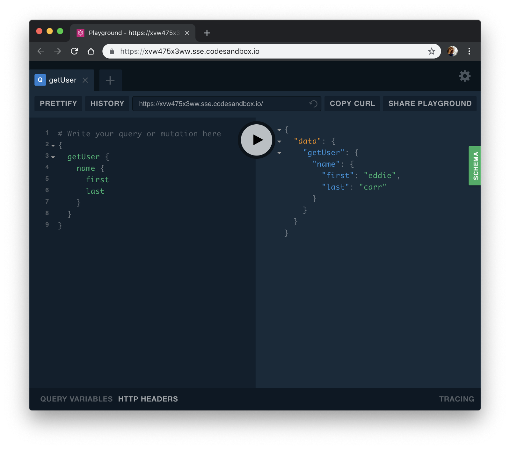

A very common use case for building [GraphQL](https://www.yld.io/speciality/graphql/) API’s is to wrap REST API’s for a better experience in the Frontend and also some more type checking in our backend.

Apollo knows this so there is a package to help with this and it’s called `apollo-datasource-rest`. It’s strong points is that it handles some of the caching for you as it runs through their cache and also it exposes a class that makes it easier for us to keep our code clean.

If you wanna follow along you can start with the starter ApolloServer sandbox on CodeSandbox that you can find [here](https://codesandbox.io/s/apollo-server).

### Wrap our REST API

For this example I am going to use the [RandomUser API](https://randomuser.me/) and we will create two queries. One for getting one random user and one for getting a set of users.

So let’s start by defining our Schema and it should look something like:

Embed placeholder 0.18524143645356794

Some of the return values from the API I don’t really want to return so I will ignore them.

Now let’s create our class where we will use `apollo-datasource-rest` and in here the first thing we need to do is to extend the `RESTDataSource` class that the package exposes to us.

In it we have a constructor where we can define our base API url. Our file should look something like:

Embed placeholder 0.6132876262660829

Now that we have the basis of our class we need to define our functions and they will all have a signature close to this:

Embed placeholder 0.8469691187084638

So we create async functions that will fetch our data, give it any parameters that we want and from the parent `RESTDataSource` we have access to some methods to interact with API’s.

Besides the `get` method we also have the normal methods to allow for `POST`, `PUT`, `PATCH`, and `DELETE` requests so you can build any type of request to your REST api.

Let’s create our function to get one single user:

Embed placeholder 0.7925558298447732

Now that we have this we can use it in our resolvers.

### Using our data sources

Moving back to our `index.js` when we initialise our `ApolloServer` there is an option we can pass called dataSources and that goes after our resolvers definition.

This property takes a function that will return an object with all your dataSources so in our case our new `ApolloServer` instantiation will now look like:

Embed placeholder 0.5498094511034592

By passing it as a `dataSource` we now have access to it on all our resolvers as part of the third argument so in our resolver to get the user we need to call the function we created in our class like so:

Embed placeholder 0.318378011734604

If you now try to run the `getUser` query like so:

Embed placeholder 0.601059440270836

You should already see some data

Let’s now code our `getUsers` function and in this one let’s also allow the user pass the number of users they wants to receive.

The endpoint for that is: _https://randomuser.me/api/?results=number_ so let’s code our function with some sensible defaults:

Embed placeholder 0.04625346787087126

So here we get a variable called people and assign it a default of 10 so if the user doesn’t pass a the argument we will just send 10 random people. This feature is called Default Parameters and you can read all about it at [MDN](https://developer.mozilla.org/en-US/docs/Web/JavaScript/Reference/Functions/Default_parameters).

Let’s now add a new function to our resolvers for query:

Embed placeholder 0.16245618418704622

In here we use the second parameter of the function and that’s because we get whatever the user passed as a parameter to the query.

If you now run something like:

Embed placeholder 0.17556144463322765

You should get three random users.

### Wrapping up

In my opinion this is a more elegant way of wrapping our REST API’s as we have a clear definition of what we are doing in each function and also we get Apollo to take care of all that’s not the actual fetching and modelling of our data.

If you want the see the full coded example you can see it here:

<Embed src="https://codesandbox.io/embed/xvw475x3ww" height={350} width={700} />

---

Photo by [Fancycrave](https://unsplash.com/photos/vdWewqfr_V0?utm_source=unsplash&utm_medium=referral&utm_content=creditCopyText) on [Unsplash](https://unsplash.com/search/photos/computer?utm_source=unsplash&utm_medium=referral&utm_content=creditCopyText)

Written by [Sara Vieira](https://twitter.com/NikkitaFTW) — Developer Advocate at [YLD.](https://www.yld.io)

---

#### Interested in GraphQL? Read more about it:

[**Create custom GraphQL types**  
_One good thing about GraphQL is having control over how our schema and our return values from an API will look like…_medium.com](https://medium.com/yld-engineering-blog/create-custom-graphql-types-999f009d3f46 "https://medium.com/yld-engineering-blog/create-custom-graphql-types-999f009d3f46")

[**The new Apollo Server is 💯**  
_On the 15th I was at GraphQL Europe and I want take some time to talk about the new release by the awesome apollo team…_medium.com](https://medium.com/yld-engineering-blog/the-new-apollo-server-is-3f2119e4e7c9 "https://medium.com/yld-engineering-blog/the-new-apollo-server-is-3f2119e4e7c9")