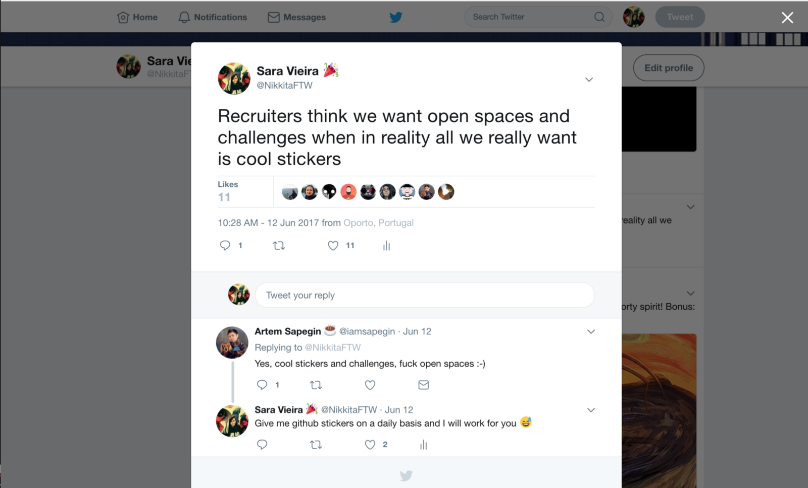

You may have noticed the “slight” change in the twitter’s ui. By that I mean that now everything has a border radius.

I think this can teach us a valuable lesson about simplicity and just what to if you want to proceed in redesign your website like this.

**Step 1:**

Open you favourite code editor if you don’t have one you can download [Atom](http://atom.io) that is amazing and free.

**Step 2:**

Open the main css/sass/less/postcss of your page and add the following two lines:

Embed placeholder 0.3280841830153052

---

That’s it ! Deploy this and have fun with your new website look 😀