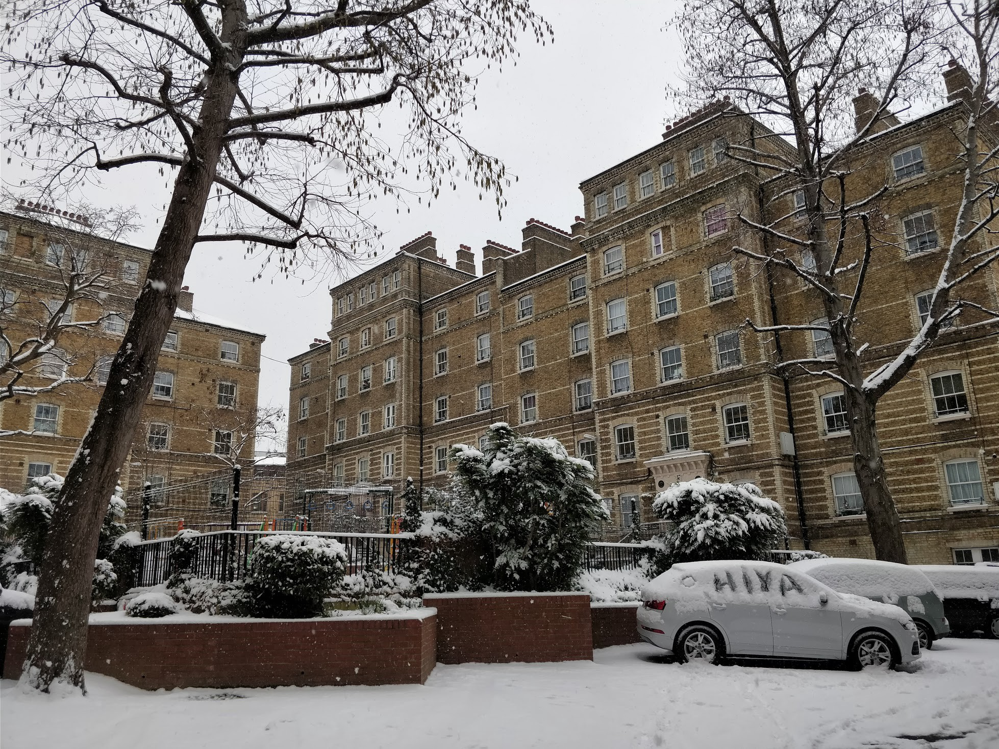

_shit about to get deep_

**Hi 👋**

My name is Sara and this is how many conferences/meetups I have this year: [https://www.notion.so/saravieira/52a9335125324fd5bc520dd413bc9ff8?v=e59d1553ee474c32abf6f7cd6cec6efd](https://www.notion.so/saravieira/52a9335125324fd5bc520dd413bc9ff8?v=e59d1553ee474c32abf6f7cd6cec6efd), if you lazy that is 22. I’m not Sarah Drasner but shit son.

I keep hearing this like:

> Oh I wish I had your job, you get to travel Europe for free, that is so cool !

I’m still friends with my high school friends even though we are now completely different people we would trust our life into each other, I guess the gay weirdos stick together. They are the ones that say this the most because they all still live where we grew up and in their heads I have the dream life.

Don’t take me wrong it’s fucking awesome, I do get to travel europe for free mostly and also get to meet incredible people.

I also get to unmeet them tho, I spend a week in every place so I get to meet incredible humans and then the week later they are gone and so am I. So I end up making friends everywhere but I rarely see them again.

But the thing is, my job doesn’t make me do this, they like it because it spreads the name of the company but besides some in London all these places I went I did because I sent the CFP or was invited, I did this on my own.

I have been thinking a lot about why the fuck I do this and prefer to live this life and not stand still and I reached a conclusion, and that by itself is a miracle in my life trust me.

I realised that the reason I want this and do all these conferences and just travel without a destination is because I don’t have a home.

I have a house in the middle of nowhere in Portugal, but no home, there is not a place that when I am in it I call it home, a place that I really don’t want to leave.

The reason I travel so much is because I am trying to find my home, the place I feel like I am at home.

Don’t take me wrong, I love doing this and I do know how incredibly lucky I am to have this life but sometimes I just wish I had a home somewhere. Somewhere I where I would unpack when I get there and truly felt at home.

Some people envy me because I have no one to give satisfactions to and I sometimes envy them because they do.

I’m going everywhere because in fact I have nowhere to go.