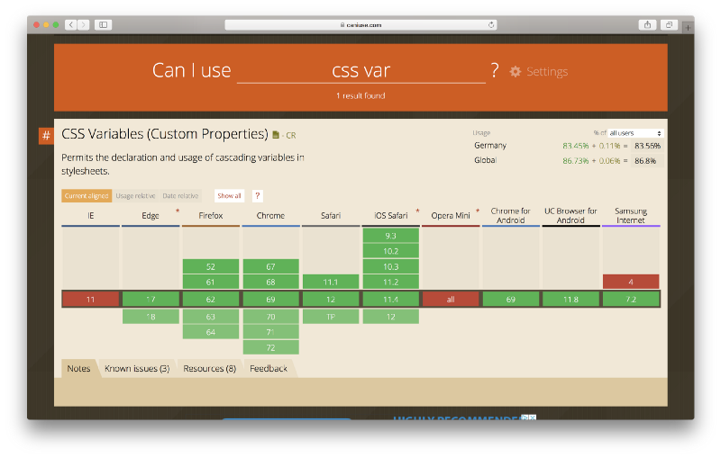

CSS Variables also known as CSS custom properties are here:

These stats are from Germany and we can see that 83.56% of the browsers used to access the internet were browsers that already support the use of CSS Variables.

Of course some older browsers will never be updated but with more then 80% of usage this seems like a very good moment to get a grasp of how they work and how you can manipulate them with JavaScript.

### What we are making

  

We will be going to create a webpage that will have theme switcher that will allow us to go from dark to light theme and also a slider to adjust the size of the text on the page.

We will be doing all of this with no frameworks and just using CSS variables.

Embed placeholder 0.2542750578780717

This was done in [CodeSanbox](https://codesanbox.io) so you can make a new VanillaJS sandbox [here](https://codesandbox.io/s/vanilla) to follow along. 

### Add the necessary HTML

  

The first step is to set up pour 

  

  

  

---

Photo by [Ethan Hoover](https://unsplash.com/photos/6pP4QXefjkg?utm_source=unsplash&utm_medium=referral&utm_content=creditCopyText) on [Unsplash](https://unsplash.com/search/photos/theme?utm_source=unsplash&utm_medium=referral&utm_content=creditCopyText)