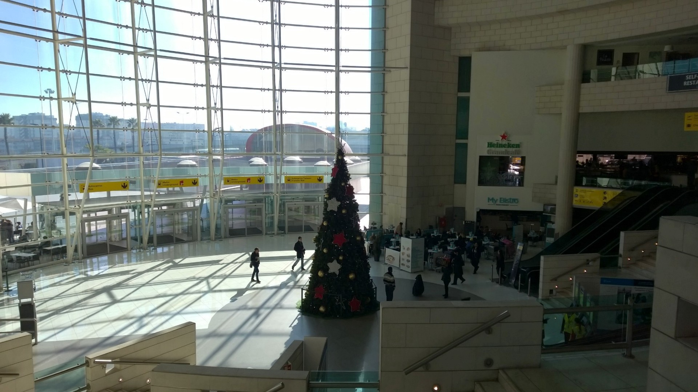

  

So this year I have seen a lot of airports and I think it’s time for me to write about this so y’all know what level of bullshit each of you expect when going somewhere. 

As a disclaimer this report will also come from me as a smoker so many things may not even be relevant if you don’t smoke but most of the love and critiques are to the general airport not the fact of smoking inside or not.

I will be updating this as I visit more airports in the upcoming months.

**Let’s go!**

### Porto Airport

Since this where I live this is where I spend most of time when it comes to airports and this airport is pretty damn sweet. You can’t smoke in it but you really don’t need it tho, you get from entrance to your gate in 30m max. Security has the fancy 3D machines so you don’t even need to take your laptop and it’s not even big so you get to your gate pretty fast. It’s also a pretty airport, it doesn’t look like it’s gonna collapse on you.

The only problem with this airport is that it’s the airport equivalent of those buses that get you to your plane. It doesn’t really take you anywhere, only places that take you places.

For example it has flights everyday to Munich, Frankfurt, London and Amsterdam so that after that you can actually go where you want to go.

**Score: 4/5**

### Lisbon Airport

This one is the airport equivalent of a scam.

You have two options, you either go to terminal 1 and be a happy human, it’s great, looks amazing, you have smoking places, plenty of space and just a ton of stuff to see and do.

Or you end up in terminal 2 and you might as well be in Luton. It’s a dump! There is nothing there, it’s about 2km from the “actual” airport, you have nothing to see, the lines for everything are huge, you can’t smoke in it and you always feel like you are walking to the final 30m of your life. It’s just horrible, even the person checking in my bag apologised when he saw it was my first time in that terminal.

**Score: 2/5**

### Schiphol Airport

Schiphol has 20km2, let that sink in! Porto is 40km2! This airport is bigger than many cities in the Netherlands!

You have deliveroo inside the airport! This is a new level of something I would assume to see, it’s a world inside it. It even has museums!

I have had many layovers in this airport that went from 50m to 6 hours and honestly I wasn’t even that bored. It has pretty decent internet, there are smoking places, you can actually go outside and smell fresh air that hasn’t been contaminated by thousands of humans running to their gates and it HAS a lot to see. It’s a pretty solid airport!

However once I flew transavia there, never do that, I landed in the beginning of the airport and taxied in the airplane for about 25m until it stoped and we had to take a bus to the terminal. If you take a cheap airline you need AT LEAST 1:30h of layover to not be running and sweating like everyone else.

Overall awesome airport if you don’t fly low cost and wtf am I airport if you do.

**Score: 3/5**

### Frankfurt Airport

  

  

  

  

  

  

  

  

  

  

  

  

  

  

Photo by [chuttersnap](https://unsplash.com/photos/qhNutmNU1pE?utm_source=unsplash&utm_medium=referral&utm_content=creditCopyText) on [Unsplash](https://unsplash.com/search/photos/airport?utm_source=unsplash&utm_medium=referral&utm_content=creditCopyText)