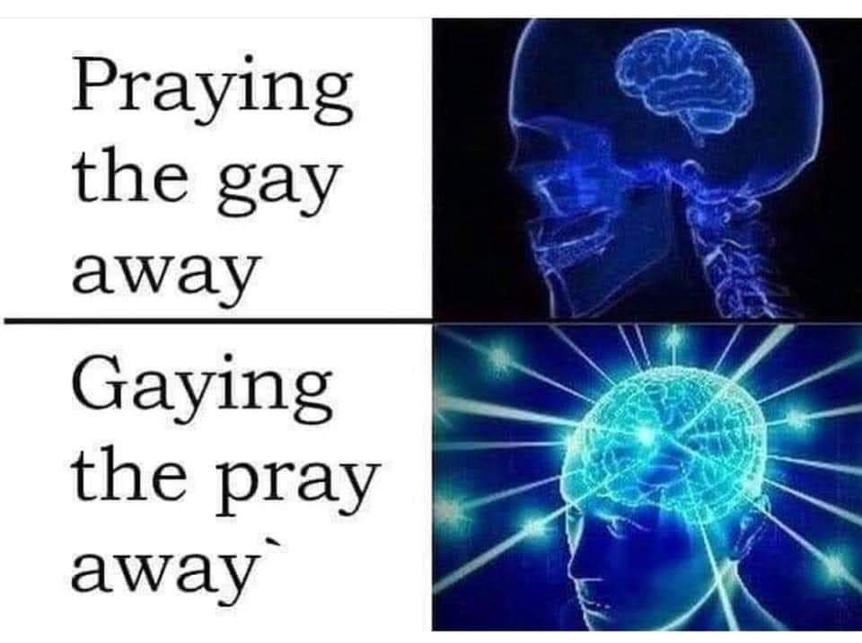

 _on_[_Unsplash_](https://unsplash.com/search/photos/shadow?utm_source=unsplash&utm_medium=referral&utm_content=creditCopyText)](./asset-1.jpeg)

_I wanna start by saying I am aware I am not famous ffs I just wanted a really deep title for this article._

---

For as long as I can remember I have low self-esteem and so do many people, it’s a common thing to have. Millions of people live with this every day, they don’t see anything good when they look at themselves and they wish they did.

I always suffered from this, it’s been a constant in my life for as long as I can remember but it only became crippling in the last two years or so.

### WTF do you mean by low self-esteem?

In really simple terms it means you wake up every day not liking what you have become, wishing you were taller, stronger, better. It’s waking up wishing you could see in yourself other people see in you.

It also doesn’t mean you think you suck at everything, I know I am good at some things, like English. I am proud of the fact that several people have thought I was American. It means you don’t see anything good besides the small good things.

Most of the times people assume low self-esteem is mostly a physical thing, you hate your nose or you could wish you would lose some weight but not always. In my case, most of my low self-esteem issues are in terms of personality, I just think I am boring, that there is nothing interesting to know in me. This obviously takes a toll on your physical appearance because you stop caring, in your head, there’s no point right?

As you can see it ends up being a vicious cycle.

> “You are an inspiration”

This is where the public eye starts. I have as pretty much like any other women in tech gotten shit in DM’s, YouTube or something else but that’s not usually the ones that get me thinking I suck. It’s actually the good ones, the ones that see things in me I could never see, those are the ones that make me feel like I am a fraud, that I am fooling these peoples.

I feel like I live in the constant fight to be what people think I am, to be someone I never saw myself being. To me, I am still a failure, not so much professionally but personally. I feel like if only I could be what some people think I am then I will be happy, then I will have it figured out and I will be okay.

I’m a code monkey who lives alone and orders take out a fuck ton. That’s all I see in me.

Sometimes I avoid meeting people I know online because I am scared this will unmask me as this really not cool human being, I’m scared I will be rejected by these human beings. That I won’t be the idea of me they have. It’s very easy for me to feel rejected by someone so in my head, it’s better to just avoid it and if I avoid it then they will still have the idea of me and not the real one.

Sometimes I don’t look at social media and I want to close everything because I know/think everyone in there doesn’t care about the real me, wtv the fuck that means.

### What about hate?

I have gotten hate, a random dude once told me people like me are the reason Trump got elected and to this day I am trying to understand that but besides the point.

Its weird hate doesn’t get to me that much but I was hated and bullied for several years, I was gay in a Catholic high school, I made a thick skin.

I can take most types of random hate and shrug it off as nothing happen and sometimes even learn something from that.

I can’t do that with the opposite. I will always assume you like me because you don’t know me.

As for my deep posts here is a meme

