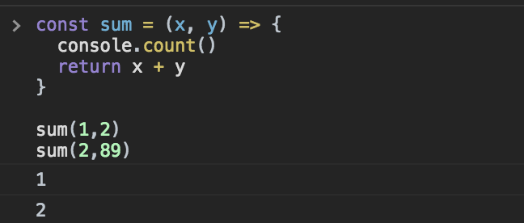

](./asset-1.png)

I use a lot of console based debugging a lot in my javascript coding on a daily basis and you may think: Nooob, use debugger !  
But the thing is I got pretty damn good a console.logging my way to the top so today I’m gonna show some awesome stuff you can actually do with console that is not just console.log.

### Text Options

What you are most used to is just writing:

Embed placeholder 0.820984648146404

Well there is at least 3 more I currently use besides log, we have `error` , `warn` and `info`

Embed placeholder 0.8003498518198744

---

This is very useful if you already have a lot of logs all over the place, also when doing an error you get a stack trace to know where that console comes from and what actually happened to get there.

### Timers

Ever wanted to run [https://jsperf.com/](https://jsperf.com/) without actually going to the website. This is exactly what timers do and you do it like so:

Embed placeholder 0.9628581092965416

The way that this works is that the tag inside the time function must be the same as the one in timeEnd and what happens is that the browser will connect these two and give you just how long the code between took to run.

Pretty sweet ah ?

### Tables

So let’s imagine you have an object like this:

Embed placeholder 0.20581749787936232

When you log it to the console you get something like this:

If only switch the log to table like this:

Embed placeholder 0.7459574580577513

You get something way more awesome:

### Groups

Another useful feature you have in your average console is the group one, this one allows to groups logs in the same group, so if have something like this:

Embed placeholder 0.46160034745393164

I know this will never happen in real life but by doing this would just have all your logs shown like so:

With groups you encapsulate these logs into the part of the code they belong.  
By adding some lines of code you get something way more organized:

Embed placeholder 0.07581459670670498

You can also collapse these groups by default for a cleaner view of what’s going on:

Embed placeholder 0.621653481269415

### Count

Did you ever manually counted logs just to know how many times a function was called?  
Turns out you don’t have to , there is a method called count on the console object that will do that for you.

Something like this:

Embed placeholder 0.18257690324706477

Would give you:

### Last trick

You can also add css to your logs but only if the first argument is a string. To do this you need to prepend _%c_ to your text and then pass the css in the second argument, like so:

Embed placeholder 0.180434360499528

I’m not saying this last one is very useful , but it’s certainly very cool.

That’s it folks! Have fun !

