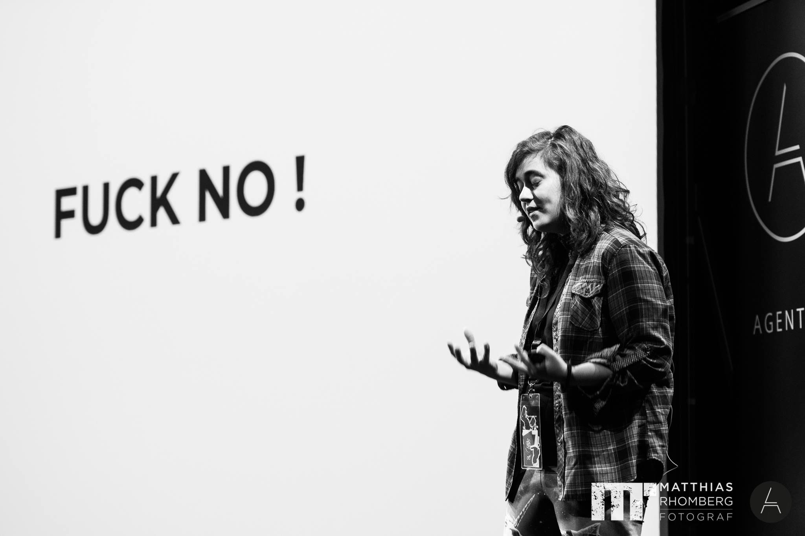

A couple of months ago I spoke about something in my brain that haunted me for years, I did a talk about mental health and panic disorders at Agent Conf and if you relate to this in any way here is the video:

<Embed src="https://www.youtube.com/embed/bovBQtB_PDo?feature=oembed" height={393} width={700} />

I can never thank the agent conf team enough for letting me do this talk, allowing me to talk about these subjects in a tech conference and supporting me each step of the way.

After this talk I have been invited to speak at three more conferences about this topic and it’s the talk I would travel the most to deliver and raise awareness. However, this particular talk is not what I am here to discuss but the feedback I got about it to the present day and how I am doing coping now.

This feedback stuck with me:

> _You’re normalising having a broken brain & helping people realise that they can make it despite that. by_ [_ScribblingOn_](https://twitter.com/ScribblingOn)

### The feedback part

This is exactly what I wanted, my talk was not supposed to cure anyone, my only objective was and still is to make people aware that they are not alone, that being broken is not something you have go through alone.

I want everyone to know that no matter your background this can happen to everyone and that you should ask for help, you shouldn’t be ashamed like was.

And I got plenty of people that DM’d me or personally thanked me because they were scared of what was going on but felt alone and didn’t know who to tell or what to do, and that I helped them get out and find help. This is the best thing I could have ever heard. Like I said in the talk I don’t care about looking stupid (point in fact: [https://meme.iamsaravieira.com](https://imgur.com/OpAiCw2)) as long as it helps one person feel less alone. To this day I believe this talk was the best thing I did in my life.

I also got some feedback from people saying that that I pretty much explained their life in this talk, that they had problems but didn’t know what was wrong and this was the best way to make others understand. Repeating myself, this talk is the best thing I’ve ever done because it actually helped people, not in coding like most things I do but in life! It crossed the boundaries of programming languages and even professions and got people united, relating to the situation and the feeling of being alone. It made them realise they are DEFINITELY not alone and that we are all in some way suffering from something no matter how we sound and look.

### Chapter 2

Ever since I was a kid I always hated being the spotlight. I know it’s weird since I speak at conferences and appear as someone who speaks very loudly. Firstly i will explain in this “piece” why do i hate being the center of attention, and about being loud, that can be easily explained with the fact that I have terrible hearing.

After doing this talk I had people tell me they look up to me and that, to me is the weirdest thing ever since to my own views I am still broken.

One thing I think I made across with this talk is that all is fine now because I fixed one problem I had. But never assume I’m not still broken, in different ways that don’t impact my life the way the panic attacks did before, yet still broken.

I still live with depression, I have bad days where I don’t find solace or see the point of things and the saddest thing is that sometimes I look at my own talk just to remind myself what I have accomplished or read some feedback and feel so much better.

This depression leads to me having incredibly low self esteem, I don’t believe myself to be worth of pretty much anything, in my head I got all the jobs I had up to this day out of being lucky and just going through the cracks and I am just waiting for the day someone finds out and outs me. #imposterSyndrome101

I have this belief that in reality high school never ends and the way you were treated in those years has a big impact on how you perceive the world and yourself. I was made fun in high school like many of the grown up nerds, first mainly because I stuttered a lot and was also a small little ball, as in, I was 1.38m(4.5 to the US) and was a bit large around the sides so kids picked on that.

After a while this all was fixed but at the same time the gay situation happened and I went to a catholic high school, you can imagine high school was never fun, also when I was school I failed math twice in my senior year.

This all led me into me believing I don’t deserve all I have. This also led me to think I was put into a position where everyone is smarter than me because I was beaten down in school and home for something I couldn’t do anything about and y’all went to university, y’all didn’t fail math.

### So why do you do talks and workshops ?

Brains are weird! No! Brains are really fucking weird!

If you do talks and workshops people think you are smart! Simple as that, the more talks I do the more people think I am smart and maybe if enough people believe that I am smart I will too!

People have different approaches to depression and low self esteem, some people hide and I do the opposite because hanging out with your brain alone is not something really healthy for everyone.

I guess the point of this article is to always know it’s okay to be broken. It’s okay to talk about it and doing something about it.

It’s not my fault my self esteem is super low, and your broken brain is not your fault. Normalise this shit and we will all be better humans and be much happier with what we achieved and are to achieve in life.