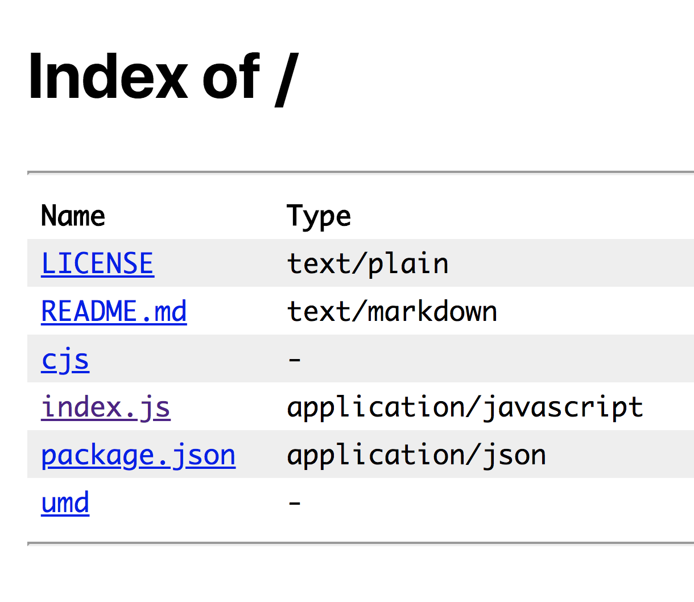
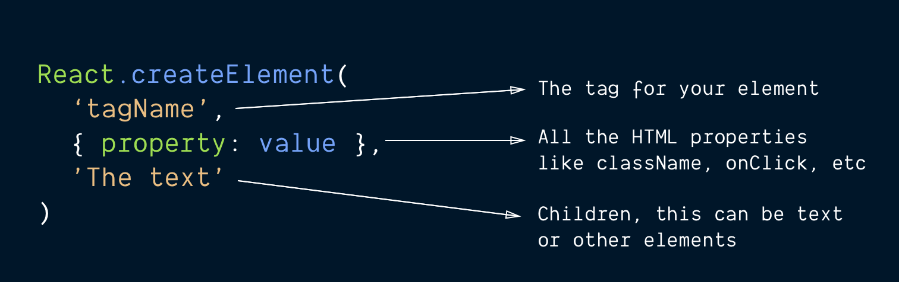
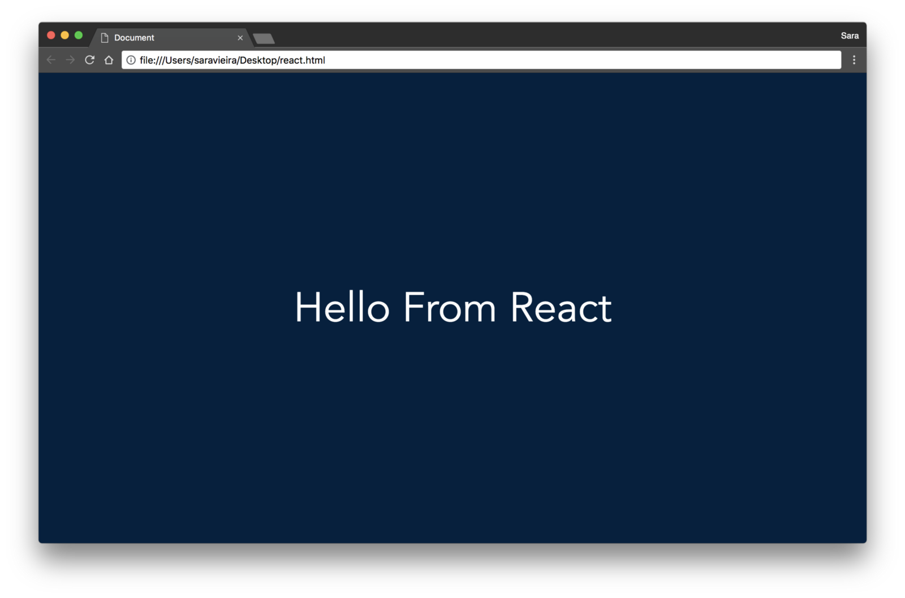

Many people starting out get overwhelmed by all the things happening in the React ecosystem. There’s this idea that what happens in [React](https://www.yld.io/speciality/react-js/) is magic and that getting started with React is super complicated unless you use tools like [create-react-app](https://github.com/facebook/create-react-app).

And honestly, it’s not as widely documented that you only need 5 minutes to actually inject React into your page. Dan Abramov has been trying to raise awareness to this and he’s been doing an amazing job, so taking from his idea let’s make you believe the 5 minutes statement.

### But how do I inject React into my application?

Well, first step is finding the files to insert, and these can be found at [UNPKG](https://unpkg.com/#/). This is like a giant CDN of all the awesome libraries and frameworks around the world.

If you go to the URL [https://unpkg.com/react@16/](https://unpkg.com/react@16/) you will see all the contents React has and in there you have two folders:

The folder `UMD(Universal Module Definition)` is the one we want as this one is understood by the browser without any bundler.

You need to also go to [https://unpkg.com/react-dom@16/](https://unpkg.com/react@16/) to get the URL of development version of React Dom as we also need this library to make our project work.

The two links are:

-   [https://unpkg.com/react@16/umd/react.development.js](https://unpkg.com/react@16/umd/react.development.js)
-   [https://unpkg.com/react-dom@16/umd/react-dom.development.js](https://unpkg.com/react-dom@16/umd/react-dom.development.js)

_Curious about the_ `_cjs_` _folder?_

The `cjs` folder is for use with NPM and the one used when you import react with npm and `cjs` means `CommonJS` and is also what is used is used in node for example.

### Creating our HTML file

To start we need an initial HTML file. I use VSCode, so here, to create a simple HTML file you just need to type `!`and then `tab` and you will have a starter file to insert the two links with script tags. Mine looks like this:

Embed placeholder 0.9959279401297849

Let’s now write some react code!

### What is JSX?

JSX (JavaScript XML) may look confusing and magical but in reality it’s just some [syntax sugar](https://en.wikipedia.org/wiki/Syntactic_sugar) over the `React.createElement` function. If we don't want any type of npm or webpack magic we can just use this function that has the same effect so let's take a look at it.

Knowing this, we can create a simple div that has some text inside and a class to be styled in CSS, like so:

Embed placeholder 0.0472022623658126

If you reload the page, nothing will happen. This is where `[react-dom](https://github.com/facebook/react/tree/master/packages/react-dom)` comes into play because react itself can be rendered into a lot of places, like native apps for iOS and Android, TV's, PDF and really anything you set your mind to.

`react-dom` is the library we want in order to render it into the web and then we need the `ReactDOM.render` function. This function takes two arguments:

-   The element we want to render. In this case, that’s is our wrapper function
-   Where we want to render it to. In this function you can render it straight into the body but I would always advise to create a new element like a main and render it there. To get this element we will use `[document.querySelector](https://developer.mozilla.org/en-US/docs/Web/API/Document/querySelector)` and pass it our `#app.`

In code this would look something like:

Embed placeholder 0.5839420363628482

If you reload the page, you can see our wrapper but it doesn’t really look nice so let’s add some CSS to it:

Embed placeholder 0.6696639824603887

And now you should see something like this when you open your index.html in your browser:

So we got the basics of showing an element and now let’s get into some more interactivity by using [React’s Component State](https://reactjs.org/docs/faq-state.html).

### Creating some interaction

In this part we are going to create the best App ever. We will get a dog photo from `[https://dog.ceo/api/breed/akita/images/random](https://dog.ceo/api/breed/akita/images/random)`, show it on the page, and also add a button to refetch another dog photo. Trust me it's going to be great!

The first thing we need to do is to make our function be a `[React.Component](https://reactjs.org/docs/react-component.html)`. The main difference for us is that these `Components` can hold state and the functions can't.

> _The state contains data specific to this component that may change over time. The state is user-defined, and it should be a plain JavaScript object. — _via [reactjs.org](https://reactjs.org/docs/react-component.html#state)

We should also consider that if we attach this state to a rendered element, this element will update once the state changes.

For our use case we will need am image property in our state that will have the source for our image. So our `Wrapper` should look something like:

Embed placeholder 0.8934951547416721

Wow! So this changed a lot so let’s through what is going on:

We now have a class instead of a simple function, you can read more about classes on the [Mozilla Developer Docs](https://developer.mozilla.org/en-US/docs/Web/JavaScript/Reference/Classes). We also extend out of `React.Component`, which means that React.Component is our parent class and we inherit methods from it.

> _The constructor method is a special method for creating and initialising an object created with a class. There can only be one special method with the name “constructor” in a class. A_ `_SyntaxError_` _will be thrown if the class contains more than one occurrence of a constructor method._ \- via [developer.mozilla.org](https://developer.mozilla.org/en-US/docs/Web/JavaScript/Reference/Classes)

A constructor can use the super keyword to call the constructor of the parent class.

After creating our base class we set the initial state that will be changed with `this.state = { image: null };` the reason this is null in the start is because we don't have an image yet. Then in the render function we return the HTML element react will create for us.

Next step is creating the image tag that will have our awesome puppy:

Embed placeholder 0.5283791791945063

We have seen this pattern before when creating our `Wrapper` component. The only thing we changed here from our `Wrapper` component is that we now receive an argument with all the props passed to the element. In the props object there is a parameter called source and set that as the `src` attribute of the image. We also don't pass any children as images don't really have any elements inside them.

Now for the button we do something similar:

Embed placeholder 0.299770036223298

Here we receive the a function that will be called when this button is clicked and will get another random puppy.

### Putting all of this together

We have all the pieces and let’s now get this all working together in our `Wrapper` component by attaching these two elements to the `Wrapper` class and it's state.

To place these two elements as children of the `Wrapper`, we need to pass them as the arguments of the `React.createElement` function. Any argument after the second one will be seen as a children by React.

Our `Wrapper` will look something like:

Embed placeholder 0.7310674048472128

Now it’s time we actually fetch the image and for that we will use the `[fetch](https://developer.mozilla.org/en-US/docs/Web/API/Fetch_API)` api provided by most modern browsers.

Let’s do that in a separate function and call it when the component mounts on the page:

Embed placeholder 0.28095087142327135

First thing we did was create a `getImage` function and in that function we get the image. When we got it we called `setState`, which is how you change the state of a component in React. Assigning the state to a new object won't work because React won't re-render the component.

In `componentDidMount` we called the `getImage` function we just created and this will populate `this.state.image`. That we can pass it to the `img` element and show our new puppy. We also pass our `getImage` function to the button so that the user can request a new puppy.

The bind in the constructor is done because functions have their own scope and not the scope of the `class` it's a part of. When we have a function like this, the value of `this` is no longer the class methods like `setState` but it's instead the own function. The `this` keyword is confusing when you first hear about so you can read more about it in the [Mozilla Developer Docs](https://developer.mozilla.org/en-US/docs/Web/JavaScript/Reference/Operators/this).

We can do two things, we can bind it manually with `this.getImage = this.getImage.bind(this)` and this will change the scope to be the class. Or we can use [arrow functions](https://developer.mozilla.org/en-US/docs/Web/JavaScript/Reference/Functions/Arrow_functions) as these ones have no scope. In this case, for clarity, I decided to go with the first one.

You can see a live version of our awesome website here: [https://react-no-jsx.now.sh](http://react-no-jsx.now.sh/)

Also the code here: [https://gist.github.com/SaraVieira/c99fd3ff7177b86c14209df92483f784](https://gist.github.com/SaraVieira/c99fd3ff7177b86c14209df92483f784)

### I want some magic!

So you want some JSX ah?

I like you! You live on the edge! I would say that to start you can go on the [Babel’s online playground](http://babeljs.io/repl#?babili=false&browsers=&build=&builtIns=false&spec=false&loose=false&code_lz=DwEwlgbgBAxgNgQwM5IHIILYFMC8AiAewDss8A-AKCigEgALLOOAqAdwICc4QLgB6cBDJA&debug=false&forceAllTransforms=false&shippedProposals=false&circleciRepo=&evaluate=false&fileSize=false&sourceType=module&lineWrap=true&presets=es2015%2Creact%2Cstage-2%2Cstage-3&prettier=true&targets=Node-6.12&version=6.26.0&envVersion=http://babeljs.io/repl#?babili=false&browsers=&build=&builtIns=false&spec=false&loose=false&code_lz=DwEwlgbgBAxgNgQwM5IHIILYFMC8AiAewDss8A-AKCigEgALLOOAqAdwICc4QLgB6cBDJA&debug=false&forceAllTransforms=false&shippedProposals=false&circleciRepo=&evaluate=false&fileSize=false&sourceType=module&lineWrap=true&presets=es2015%2Creact%2Cstage-2%2Cstage-3&prettier=true&targets=Node-6.12&version=6.26.0&envVersion=) and play with it a bit. Once you understand it and want to apply to this exercise without much setup you can follow [this guide by the react team](https://reactjs.org/docs/add-react-to-a-website.html#add-jsx-to-a-project).

After this you can start playing on [codesandbox](https://codesandbox.io/s/new) that offers the whole environment online.

Adding JSX to a project is just like adding a CSS preprocessor. It’s a single command you can run to convert all your script tags. You don’t need to install webpack or similar tools.

### Conclusion

Hope this cleared some of the magic React sometimes feels to have and got you excited about it. Even if you already know React I hope this has taught you some new fundamentals you might not be aware of.

Go and build dope stuff with React! ⚛️

Thank you to Dan Abramov for bringing this to light!

---

_Thank you to_ [_Carolyn Stransky_](https://medium.com/@carolstran) _and_ [_Carlos Vilhena_](https://medium.com/@carvil) _for reviewing my horrible grammar !_

_Also Thank you to_ [_Artem Sapegin_](https://medium.com/@sapegin) _for the awesome photo_

Written by [Sara Vieira](https://twitter.com/NikkitaFTW) — Developer Advocate at [YLD](https://www.yld.io).

---

#### Interested in React? Read more about it:

[**Rolling your own Redux with React Hooks and Context**  
_For managing shared state in complex JavaScript applications, Redux is undisputedly the most popular choice. At the…_medium.com](https://medium.com/yld-engineering-blog/rolling-your-own-redux-with-react-hooks-and-context-bbeea18b1253 "https://medium.com/yld-engineering-blog/rolling-your-own-redux-with-react-hooks-and-context-bbeea18b1253")

[**A tale of React Server Side Rendering**  
_I want to start by mentioning that as of starting this I didn’t have a lot of experience with SSR besides adding styled…_medium.com](https://medium.com/yld-engineering-blog/a-tale-of-react-server-side-rendering-cb95a441ca01 "https://medium.com/yld-engineering-blog/a-tale-of-react-server-side-rendering-cb95a441ca01")