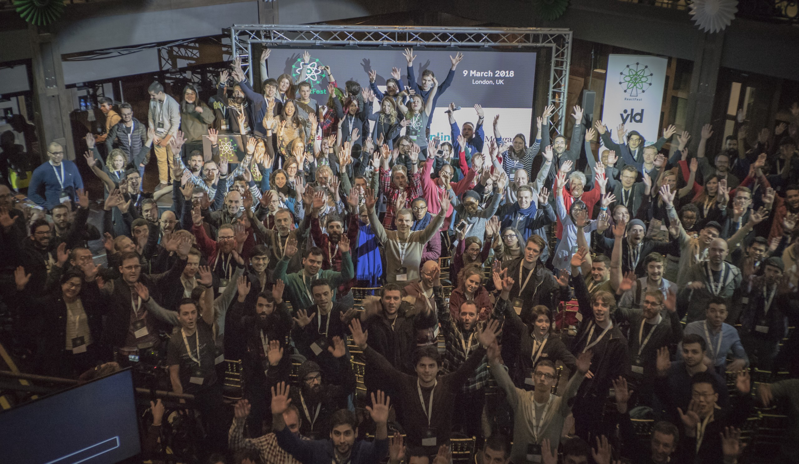
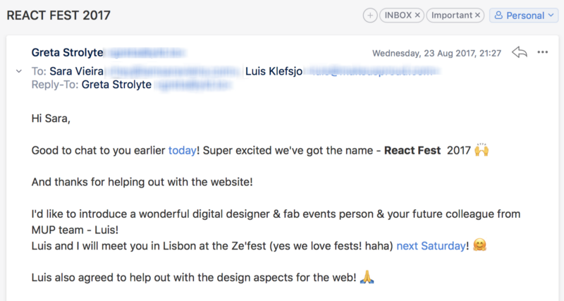

> Before starting I want to thank [Greta](https://twitter.com/gretastarlight) for her continuous efforts to make this conference happen and to make working at YLD more and more fun to do. A huge thank you to all volunteers, speakers and attendees that helped the conference be amazing. Also many thanks to [JSHeroes](https://jsheroes.io/) for giving me the idea of doing this by being so open [about finance in their conference](https://medium.com/cluj-javascripters/jsheroes-2018-transparency-report-3266c18d8729).

In March, YLD and a bunch of people from London organised a conference called [ReactFest](http://reactfest.com/) and it was an amazing experience for everyone involved. Today I want to share what exactly happened to the money in that conference because we want to take this as an opportunity to make the conference world a bit more transparent.

Here is the first email where Greta, Luis and I decided on the name for the conference:

**Fun Fact:** I only joined YLD in September that year.

Let’s talk about money!

The facts about the conference:

-   Days: 1
-   Speakers: 14
-   Attendees: 240
-   MC: [1](https://twitter.com/jevakallio)
-   Workshops: 2
-   Diversity Tickets: 20+ tickets
-   Cost: **£37K**
-   Turnover: **£54K**

### Expenses:

-   Staff — We had amazing help from the people in London and also YLD so we had a lot of volunteers — £0
-   Speakers — flights, accommodation, speaker dinner, gifts and also trips for speakers and me from the airport because London is confusing — £6.6K
-   Venue + food & drinks, including workshops— £21K
-   Photo and video services, including livestream and the screen we set up— £5K
-   Free Swag, T-Shirts, Stickers, Lanyards — £1.8K
-   Fees — Ti.to, Stripe —£1.7K
-   Miscellaneous — Website and food for volunteers and staff — £150

So that was the money spent but how did we actually manage to make money?

### Let’s go over that:

-   Tickets — 90% through ti.to and some to companies we work with, this also includes workshops — £36K
-   Sponsorships — £18K

### Math:

-   Profit : 53-37 = 17K  £

I must admit this is the biggest first world problem I have ever faced in my life but since this conference is not supposed to make any money we have decided to split the money in 2 ways:

-   50% will go into the next non profit event we organize ([Design Systems London](https://www.designsystemslondon.com/)) and then if some profit comes out it will also go into the next event.
-   The other 50% went to: Reassure the continuation of [ReactJS Girls](https://www.meetup.com/ReactJS-Girls-London/), to sponsor [Concatenate](https://concatenate.io/) and [yougotthis.io](http://yougotthis.io).

So that’s it for today, any questions or remarks about this you can always reach us on [Twitter](https://twitter.com/ReactFest) and we will love to answer any questions you may have.

Embed placeholder 0.8168003817594369

**Thank You**

_Sara Vieira and the ReactFest Team_