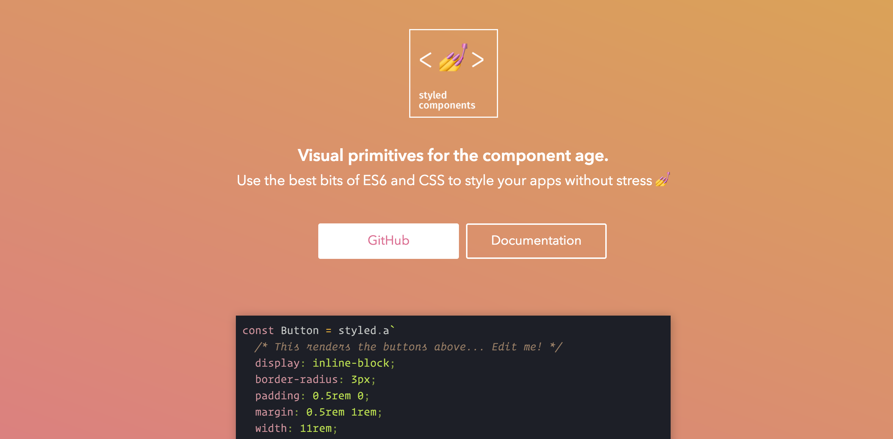
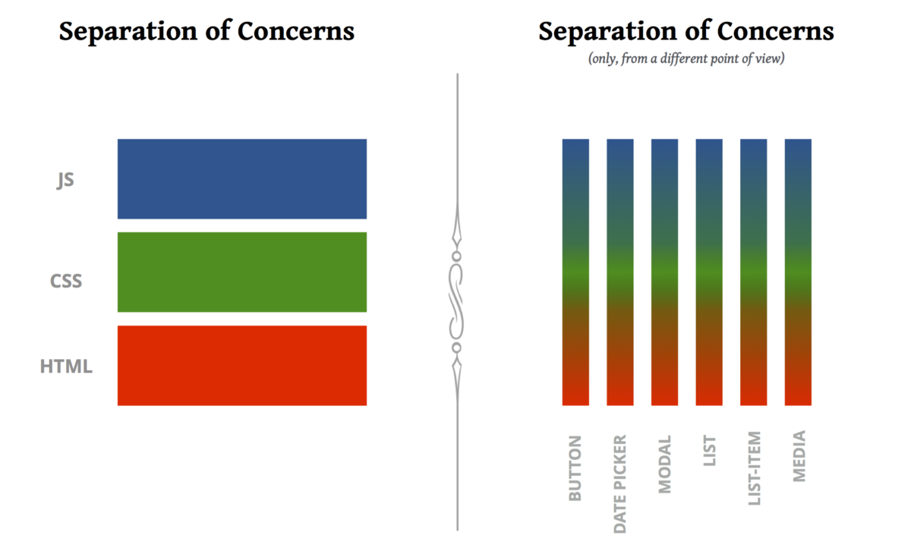

One thing that always kept me a little nervous about CSS in JS is that all examples included the CSS in the JS file and that was something I never liked.

We all know this amazing graph and it is true but for someone who keeps all her functions , api calls and flow types in a different file, this idea was a little weird so I did a little discovery and also asked around in the styled-components community and saw that separating your CSS and JS is completely doable.

That was it ! I was never leaving styled components now ❤️ 🎉

### Awesome Sara ! But How ?

Chill guys, you know these articles need a intro first.

Okay so let’s imagine you have this component:

Embed placeholder 0.08919809787709276

So the Section and Paragraph don’t contain any props so they are the easier to separate and we will move those first.

Let’s create a _style.js_ with the following code:

Embed placeholder 0.6791163741180759

So now in our index we can delete the code and replace it with regular imports:

Embed placeholder 0.5452260209568895

Cleaner ah ? 😉

Let’s now move our button to the _style.js_. The idea is that we can’t move it like it is because it receives the props and we don’t have those in the _style.js_.

The solution is to use the [_css_](https://www.styled-components.com/docs/api#css) helper in styled-components. The main difference is that when using [_styled_](https://www.styled-components.com/docs/api#styled) the returned value is a full blown react component and when using [_css_](https://www.styled-components.com/docs/api#css) all that is returned is the CSS of that element and not the element .

Our _style.js_ will now look like this:

Embed placeholder 0.06825395143999469

And our _index.js:_

Embed placeholder 0.530018703112006

We still need to instantiate the component in the index because what we did only created the CSS not the react component but I find this a cleaner way of writing CSS in JS.

All of this is of personal opinion of course, you may like your styles next to your component and that is totally awesome, I’m just sharing this hoping that somewhere someway someone will need this like I did 😝

### What about extend ?

Well… when you use the _css_ approach you loose the extend but you can also concatenate styles like this:

Embed placeholder 0.7531651502101104

It’s not perfect but I am happy about it as middle term to having all of these separated.

I think this can give you a lot of flexibility, for example in one of my projects I have a file only for animations like so:

Embed placeholder 0.36895628663069724

This way I can have the best of both worlds ! Some Javascript in my CSS and neatly separated files like my brain desires so much.

Thanks to [Phil Plückthun](https://twitter.com/_philpl) and [Max Stoiber](https://twitter.com/mxstbr) for helping figure this out ❤️