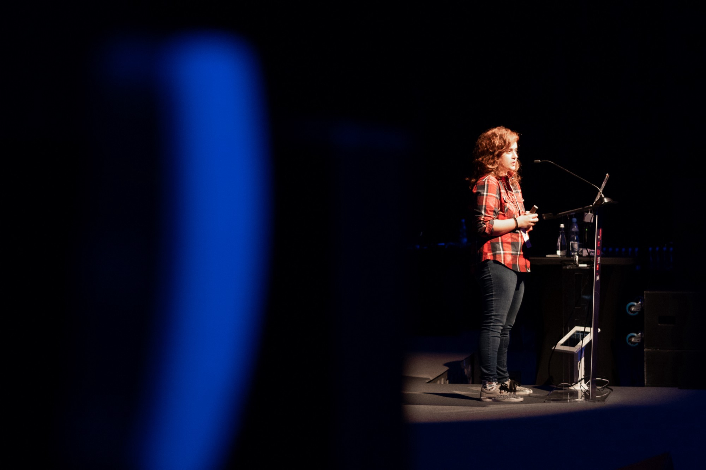
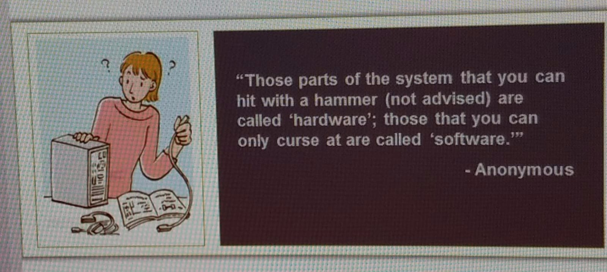

## Like the click baity title? Nice! Now let’s talk about the “glamorous” conference life.

I grew up mostly average class, I was never not eating poor or anything but I never had big stuff mostly because my parents couldn’t afford it. I never even flew until 2014 and that was for my first conference so most of the my vacations were camping and stuff like that and I always saw conferences as the real vacations where I could actually travel places. Up until last year before joining YLD I made 16K a year soooooo … not a lot of travelling was possible.

I’m not saying this for you to feel sorry for me, don’t do that, I had a fucking awesome childhood and I still love camping. I am saying this for the rest of the article to make sense.

For as long as I can remember my mom makes minimum wage and that is 580 euros in Portugal so I have been pretty aware of how lucky I am to be able to make waaay more then she does sitting at a computer, doing what I love and getting shipped to free trips. I was also always brought up to accept things when they are free because I couldn’t afford them if they weren’t.

In the beginning that’s what you see. You see free places to go where you can share your nerd passion with other people that are just excited as you. You can make friends like you and not feel bad about talking JavaScript stuff during lunch and it’s fucking amazing because you feel like you belong and that is like a drug.

Also someone literally emails you and tells they like the way your present and want to fly you and pay for a trip in exchange for you talking about something you love … Who the fuck would say no to that?!

**Me apparently!**

### What happened?

I find it funny that a lot of people envy me but most of the people who don’t are people who travel for work too. Traveling is amazing … Until it’s work.

I find it really hard to say no to things, due probably to my low self esteem I insist on saying yes to things when asked and so I got myself in about 50 conferences and meetups this year.

](./asset-2.png)

Some people can look at this and say this isn’t healthy and some people just see how lucky I am to be invited to these things and don’t take me wrong I am very lucky but doing this takes a huge toll in you as a human.

The person who got really excited to get on a plane and travel somewhere new now forgets she has flights and wants to be home for weeks in a row.

If you travel this much you don’t really have a home, your home is everywhere and no matter of how much of a digital nomad you consider yourself to be you need a home, you need somewhere where everything is okay and you just feel like you are home.

I didn’t have that for so long, I am trying to make berlin my home but I honestly don’t even know how to do that. I am so used to living out of hotel rooms and airbnbs that I honestly don’t know how to make somewhere feel like home anymore. This feeling struck me really hard, I felt homeless, I felt alone.

A lot helped to this feeling, one of the things is that I mostly travelled alone and that sometimes is a good idea but not always, there are talks or days where you need a friend to cheer you up and no one is there.

That’s the thing about travelling. It’s all fun because that’s what you show but no one is there when you crying in a hotel room because you feel so alone. No one is there when you feel so overwhelmed by all the things you need to do that you literally want to cancel everything. Most people care about the good part not about this part, they don’t understand this part. Most people don’t understand how something so “good” can break someone inside.

I don’t blame them, it’s hard to understand how someone can LITERALLY complain about getting free shit!

Nothing is free though, everything has a price. Every time I do a talk I am shit scared that someone will ask a question that will unmask me as a fraud or whatever because imposter syndrome is a bitch. Every time I get on a stage I still get nervous and shake everywhere. Doing this over and over has a price on your brain, on your health and on you in general.

Not just this but also many times the fact that when you go somewhere like this you are expected to be out of your comfort zone, you are supposed to socialize with people 24/7 and that’s not me. I feed on alone times, that’s how I get my energy and being somewhere all day where I have to interact with people drains me inside mainly when it’s somewhere you don’t know. You can’t go home. Even if you want to badly you can’t just disappear and go home because that’s not how the world works no matter how much you want it work like that sometimes.

It’s funny because when I was starting I always looked at conference people like the awesome ones, those who had their life figured out and I always assumed that if I could do that, I would feel awesome and I would feel like I had my life figured out. I learned the hard way that having people clap for you doesn’t actually make you feel better about yourself when you are alone.

### Are you cancelling every conference?

No. I cancelled some and will be more careful about the ones I do in the future, I will take my health and happiness more into consideration. That doesn’t mean I’ll stop that just means I won’t drain myself to the point of having to write one of these again. I still love conferences but like everything in life it needs to be in moderation.

I hope this makes sense to someone and I hope the next time someone travels a lot for work you don’t just look at them and think how lucky they are.

I hope next time you ask them how they feel. Sometimes just hearing someone ask that helps more then you can ever imagine.

—

If you made this far here is a meme:

<Embed src="https://upscri.be/50d69a?as_embed=true" height={350} width={700} />