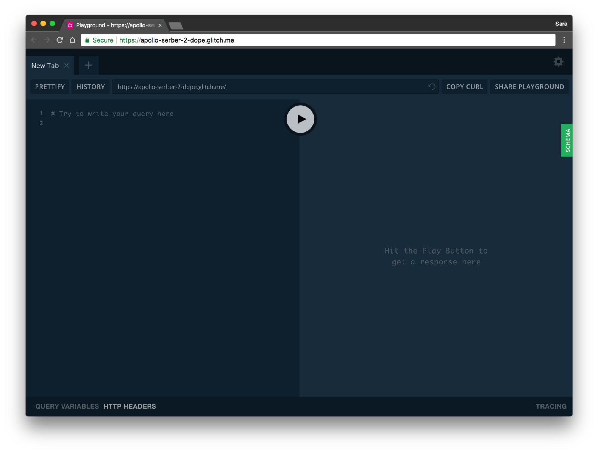
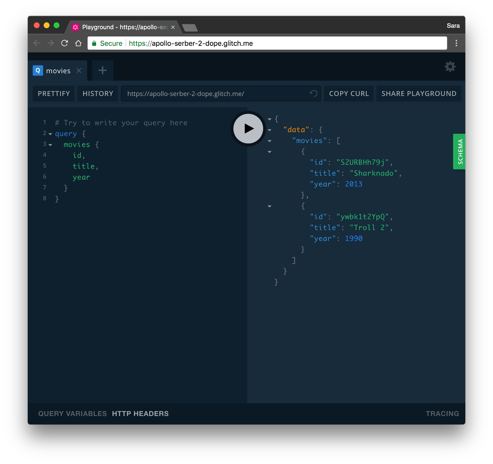

On the 15th I was at [GraphQL Europe](https://www.graphql-europe.org/) and I want take some time to talk about the new release by the awesome apollo team that was announced there with a talk by [Peggy Rayzis](https://medium.com/@peggyrayzis) about the new Apollo Server.

You can checkout the slides she used so you can get an idea of the new server.

Embed placeholder 0.9013398798685179

In this article I’m going to focus on how to get started with it.

### How to get started

First step is to create a folder and initialise npm in it so that we can install the apollo server dependency:

Embed placeholder 0.620551114963642

All that `-y` does is skip all the questions and give you a shinny new project to start with. Let's now install our dependencies:

Embed placeholder 0.25397583057947104

We need the `apollo-server@rc` to get all the new shiny features, `graphql` because, well, we are working with it, and I am installing `[random-id](https://www.npmjs.com/package/random-id)` to give us an easy way to create random and unique IDs.

### Our Data

In this example, I am going to use a movies array that we will query and mutate. So our `index.js` should look something like:

Embed placeholder 0.424892316240987

If you’ve never met me you should know I love horrible movies.

In this code we are importing the server and the query language(gql) from `apollo-server` and then importing `random-id`.

As for our data we have a list of two movies that have an ID, title and a year. With this we can start defining our types.

### The Type Definitions

So, our id will be of type ID, the title of type String and, our year of type Integer. So we can start by adding that after our movies array, and also a root query for all movies that will return an array of movies:

Embed placeholder 0.07626796561900662

Awesome! We already have a small query to work with so now let’s start adding the resolvers.

### The resolvers

This is where the magic happens. You give an argument to [GraphQL](https://www.yld.io/speciality/graphql/) and in the resolver you tell it how to resolve that to actual data.

In our case we need to resolve the Query movies to return the array of movies we created at the top so we need something like:

Embed placeholder 0.10121476178974631

As you can see the names need to match for graphql to know where to get the resolver from.

All done, we can now start the server 😄

### Start the server

For this we need to create a new instance of the `ApolloServer` and pass it our typeDefs and resolvers. Then we need to listen for the server to start and just for convenience let's also log out the url.

Embed placeholder 0.3704001692785637

Now by running `[node](https://www.yld.io/speciality/node-js/) index.js` in your terminal you should see this in the browser:

Now when you run the query:

Embed placeholder 0.5855842374166751

You should get something like:

Don’t forget that your ids will be different as we are using random-id.

Awesome! We got something returned but it’s kind of bland, it would be great if we could get a movie by id right?

Let’s code that!

### Queries with parameters

First, we need to update is our type definitions to add a new one: a query that will receive an ID as a parameter and return a single movie. So our schema will look something like this:

Embed placeholder 0.5442205063838617

That `!` after ID means that it's a required field and that the query will return an error if not present.

With the type definitions updated, let’s now create our resolver and in there we can use the [find method](https://developer.mozilla.org/en-US/docs/Web/JavaScript/Reference/Global_Objects/Array/find) in JavaScript to get the first item that matches the id we got in the parameters.

Embed placeholder 0.1697343085491685

Let’s take a look at this function and go over the parameters it receives. The first one as we can see is not used and that one is the parent but since this query is a first level query we don’t need it. In the second parameter we get all the arguments the user passed and from that I deconstruct the id so that I can use in it the find.

If you restart the server and try movie query with an ID, you will see that it returns one result.

This part is done and we can now pass parameters to our query and drill down the information we need.

### Mutations

In this last part let’s go over creating a mutation that will add a movie to the array.

A mutation in it’s essence is the same as a query, what matters is what you do inside the resolver, the difference in name is for us to make more sense of our code.

In our type definitions we need two things. First we need to create a new Type called Mutations and this is where our addMovie Mutation will live.

Then inside this new type we create the add movie mutation that will receive two parameters, the title that is a String and the year that is an Integer and after the movie being created it will return that exact movie.

Returning what you created or deleted is a good practice in GraphQL.

In schema definition language that looks something like:

Embed placeholder 0.7866850406996984

That’s all we need for our type definitions.

For our resolvers we need to think that we are really only modifying an array. That means we can push an new element to it with the two parameters the user passed and a generated id into movies and it will reflect in the array.

Embed placeholder 0.46345719555185383

As you can see we defined a new movie with what the user gave us and a random id, we then pushed that to the movies array and finally returned what the user created.

If you restart your server server an run a mutation like:

Embed placeholder 0.996840183832159

You should get your newly created movie in the right side and when you run the movies query you will now have 3 movies instead of 2 and that means the mutation worked and you got a functional Apollo Server in about 60 lines of Javascript.

### The Code

You can checkout all the code used here: [https://glitch.com/edit/#!/apollo-server-2-dope](https://glitch.com/edit/#!/apollo-serber-2-dope?path=package.json:1:0) and since glitch is amazing you can even play with it here: [https://apollo-server-2-dope.glitch.me/](https://apollo-server-2-dope.glitch.me/)

Have fun with GraphQL and build amazing things ⚡️

---

Thank you to [Sérgio Ramos](https://medium.com/@ramitos) , [Carolyn Stransky](https://medium.com/@carolstran), [Carlos Vilhena](https://medium.com/@carvil) and [Tamlyn Rhodes](https://medium.com/@tamlyn) for reviewing my blog ❤️

Written by [Sara Vieira](https://twitter.com/NikkitaFTW) — Developer Advocate at [YLD](https://www.yld.io).

---

#### Interested in Apollo? Read more about it:

[**Using Vue with Apollo**  
_I know it may seem weird that I am writing about vue but honestly I really like Vue, I blame Sarah Drasner and her…_medium.com](https://medium.com/yld-engineering-blog/using-vue-with-apollo-65e2b1297592 "https://medium.com/yld-engineering-blog/using-vue-with-apollo-65e2b1297592")

[**React is just JavaScript**  
_Many people starting out get overwhelmed by all the things happening in the React ecosystem. There’s this idea that…_medium.com](https://medium.com/yld-engineering-blog/react-is-just-javascript-88600553269c "https://medium.com/yld-engineering-blog/react-is-just-javascript-88600553269c")