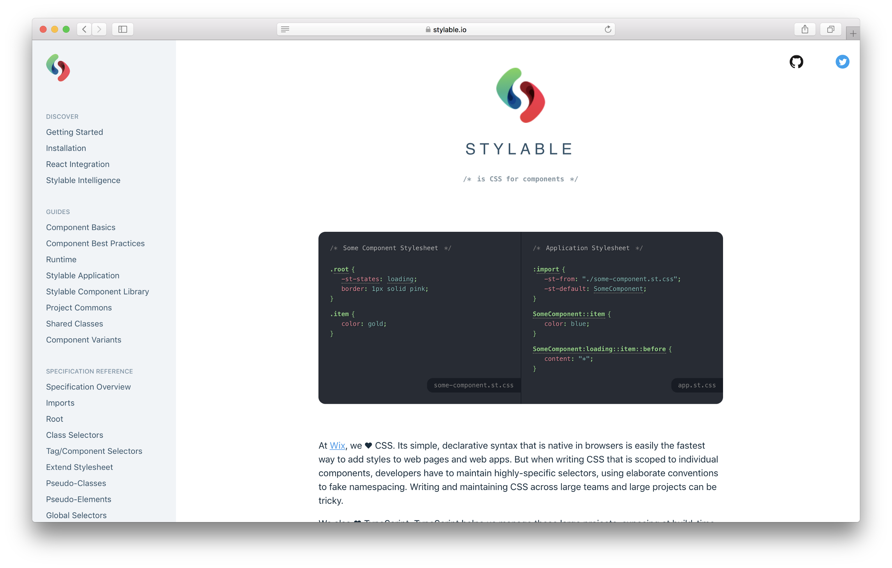

Stylable is a new way to style your react components created by [Wix](https://www.wix.engineering/) that uses the full power of CSS for the writing and syntax and the JavaScript one for the component magic we all love.

### Install

  

Stylable uses a webpack plugin for it work with React and if you are confortable with Typescript and want to code with it I would advise you to use their scripts for create-react-app:

```
create-react-app --scripts-version stylable-scripts my-stylable-app
```

In my case I don’t work with Typescript and just wanted to use it with vanilla js so I want ahead and installed the webpack plugin:

```
npm install stylable stylable-webpack-plugin --save-dev
```

And added it to the plugins section of Webpack:

```
plugins: [
  new StylableWebpackPlugin()
]
```

Since I was using [Razzle](https://github.com/jaredpalmer/razzle) I should also warn you there can’t be any rules for CSS files attached otherwise it won’t work. I ended up writing a plugin for Razzle to do this and you can the code in [GitHub](https://github.com/yldio/razzle-plugin-stylable/blob/master/index.js).

### The Awesome of Stylable

I’m going to start with what suprised me the most in a very good way and that was the ease to create mixins in JavaScript that you can use in your CSS, for example I had a file called flex.js with this code:

You can just import it into your css like:

This was the first thing that stood out to me and made me want to try it much more.

The way to apply styles to your JSX works like this:

What this means is that your parent element in the file will always be the root to stylable and to it you can pass your props, in this case the button could also be secondary or tertiary so I pass that as the second argument of the style function and all the props as the third argument.

After defining your root component you would call your styles like in CSS Modules and use the CSS as an object with keys in it.

The amazing part of passing the props like this is that now we can define the states of our button in the CSS:

As you can I am also using variables for the background colors and to toggle the toggle the styles between the states of the button. These states have the syntax of pseudo elements but don’t worry because passing something like `:after` would still target the correct thing.

I am importing them and them passing the ones I use into `st-named` and this means only these variables will be imported. If you think about the difference between the first and second import is like writing these two statments in JavaScript:

So we get to have tree shaking in our CSS and just important what we want and then Stylable will remove all that is not used. This is pretty amazing!

You always need some global styles and stylable makes that pretty simple with the `:global` keyword