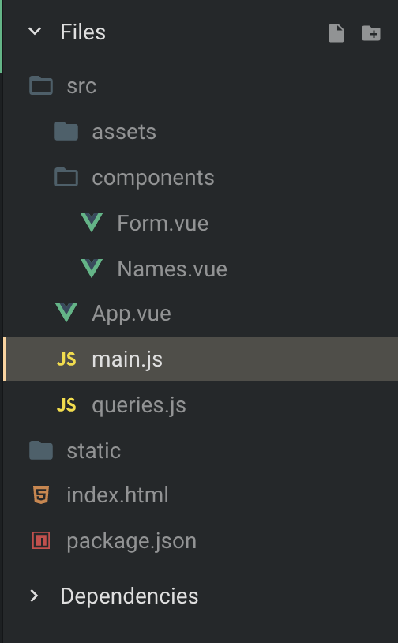

I know it may seem weird that I am writing about [Vue.js](https://www.yld.io/speciality/vue-js/) but honestly I really like Vue, I blame Sarah Drasner and her course on frontend masters but ever since I started getting the beauty of Vue and it’s something I use sometimes, like for the original of the [ReactFest](https://reactfest.com/) Conference website… I didn’t see the irony, I promise.

In this article we will be creating a simple list of names where we have one query for getting the names and a mutation that adds a name.

If you want to see what we are building or want to skip right to the code you can find it here:

<Embed src="https://codesandbox.io/embed/p2mnrp56x" height={350} width={700} />

### Installing ALL the things

Thank you to Apollo Boost we just need 3 things to get started so let’s install:

```
yarn add graphql apollo-boost vue-apollo
```

My project also uses tachyons but that is not a necessity in any way so just these three packages are enough to do everything we want 🚀

### Setting up vue-apollo

If you started with the [vue-cli](https://github.com/vuejs/vue-cli) or Codesanbox you will get a main.js that starts our app, it imports vue and renders our main component and this is where we will add vue-apollo and all the config needed.

First thing is to import what we need from apollo-boost and vue-apollo:

Embed placeholder 0.9527747101543032

After importing this we will initialise vue-apollo by passing a uri to the ApolloClient and telling vue to use vue apollo as a plugin.

Embed placeholder 0.7276829435188898

Last step of our set up is to set up our provider to be the apolloProvider:

Embed placeholder 0.19020518307165157

All setup is done and now we can start writing them queries.

### Files

For this I used this file structure:



In the app.vue I just imported the Form component that will hold our mutation to add the name and the names component that will have all the names in our server.

My app.vue looks like this:

Embed placeholder 0.5369037183414709

The queries.js file just contains all the queries we need to make requests to the server and the code is:

Embed placeholder 0.40719225547731686

### Let’s get them names !

Let’s start hacking our Names.vue and get the names.

First thing we need to do is import our query and also start our ApolloQuery component, like so:

Embed placeholder 0.5966568044429057

First thing I did was import the GET\_NAMES query from our queries.js file and set it as the query property on the data so that we can call it in our template.

After that I initialised the ApolloQuery component passing it the same query we just defined and this will return a template that get the result from the query as props that we can use inside it.

Inside this template let’s first check if it’s loading or there is an error and we do that by creating two elements that check for those propreties:

Embed placeholder 0.033356868382220295

Now that we got ourselves covered and know that when the section is rendered we have some data we can start by just displaying a list of all the names that come from our server using:

Embed placeholder 0.7837971472242293

If you try this code you see that we can indeed see the names in the page but there is a small problem we haven’t defended against, what if there is data but the server has no names ?

Right now we get an empty ul but we can fix this by checking for the length of the allNameses property in data and only if it has any names we render the ul, in the case it doesn’t we will just render a span that tells the user there are no names in the server.

Embed placeholder 0.3675169044768336

Awesome we got our bases covered here !

In this case we didn’t need any variables but in case we did we just need to add a prop to the ApolloQuery component called variables that accepts an object with all the variables you need.

Embed placeholder 0.7334670706447983

### Add them names son !

Let’s move to our Form.vue where we will add our name to the server using a mutation.

First thing is import the mutation query from our queries.js and also create a simple form to hold the name the user inputs, your component should look something like:

Embed placeholder 0.296477490493648

So far we have a pretty standard form, it just has one input that has a model for some two way data binding and also calls a method on submit.

The .prevent you see after the v-on:submit simply tells vue to prevent default before calling the method passed so that we don’t have to that manually, a great helper !

Let’s create our method:

Embed placeholder 0.9940118690496476

All we really doing here is saving the users input in a variable called name because we want to clear the input before we actually start the mutation.

To start the actual mutation we call:

Embed placeholder 0.11638621594397436

As you can see we call this.$apollo.mutate and we are able to do this since we instructed vue to use the apollo in our main.js. In the actual call we pass in the mutation and also all the variables we need for the mutation to occur.

If you try to add a name now and then reload the page we see that our mutation occurs and we get the new name inserted but this is not the desired outcome, we should see the the added after the mutation is done and we can do that by updating the cache in an update function that vue-apollo provides:

Embed placeholder 0.30988836021837374

In our update function we read all the names we have with our GET\_NAMES query and then concat the name we just added to that array so that we can see the changes right after the mutation completes with success.

**What if there is an error ?**

We need to add a catch to our mutate function since this returns a promise. If there is an error we need to add the name the user tried to add back in the input and also populate the error key in our data object so that we can access this in the template and show the user the error:

Embed placeholder 0.12201728038844961

After adding this to show the error to the user we just need to add:

```
<div v-if="error">{{error}}</div>
```

Somewhere in our template and if there is a mutation error the user will see the error with the name they wrote in the page, return the name to the input and also log out to the console the actual error.

### Optimistic responses

We can stop here and the user gets a pretty good experience but in this case it does because I have a pretty fast internet and the server is also pretty fast since we are using graphcool.

However, if we had a really bad internet or the api was really slow we would have a moment where nothing happened and that may confuse the user. To fix this we can add an optimistic response, this will be something that will run and call the update function as soon as the mutation function runs instead of having it run after there is a success.

In this case we can add it at ease because it will be reverted and the catch statement will also run so adding this is a win win.

vue-apollo has a really handy optimisticResponse method in the mutate function that we can use to send a fake response and update the cache. In here we send exactly what we expect to receive from the server so we send:

Embed placeholder 0.9446402092974384

Only difference as you can see is that we send a fake id as this one will be updated as soon as the mutation completes or this will be reverted if it fails.

That’s it, we created a simple interaction with apollo and vue 🚀

### Conclusion

I also added another mutation that deletes an item in the code sandbox that you can take a look and inspect the code even better.

Hope this was useful, I see the [React.js](https://www.yld.io/speciality/react-js/) devs including me super excited about GraphQL and it looks like there excitement dies a bit in other frameworks but it shouldn’t as it keeps on being awesome dealing with [GraphQL](https://www.yld.io/speciality/graphql/) in vue because of the awesome vue-apollo !

Written by [Sara Vieira](https://twitter.com/NikkitaFTW)— Developer Advocate for [YLD](https://www.yld.io).

---

#### Interested to read more? You may also like:

[**The new Apollo Server is 💯**  
_On the 15th I was at GraphQL Europe and I want take some time to talk about the new release by the awesome apollo team…_medium.com](https://medium.com/yld-engineering-blog/the-new-apollo-server-is-3f2119e4e7c9 "https://medium.com/yld-engineering-blog/the-new-apollo-server-is-3f2119e4e7c9")[](https://medium.com/yld-engineering-blog/the-new-apollo-server-is-3f2119e4e7c9)

[**A tale of React Server Side Rendering**  
_I want to start by mentioning that as of starting this I didn’t have a lot of experience with SSR besides adding styled…_medium.com](https://medium.com/yld-engineering-blog/a-tale-of-react-server-side-rendering-cb95a441ca01 "https://medium.com/yld-engineering-blog/a-tale-of-react-server-side-rendering-cb95a441ca01")[](https://medium.com/yld-engineering-blog/a-tale-of-react-server-side-rendering-cb95a441ca01)